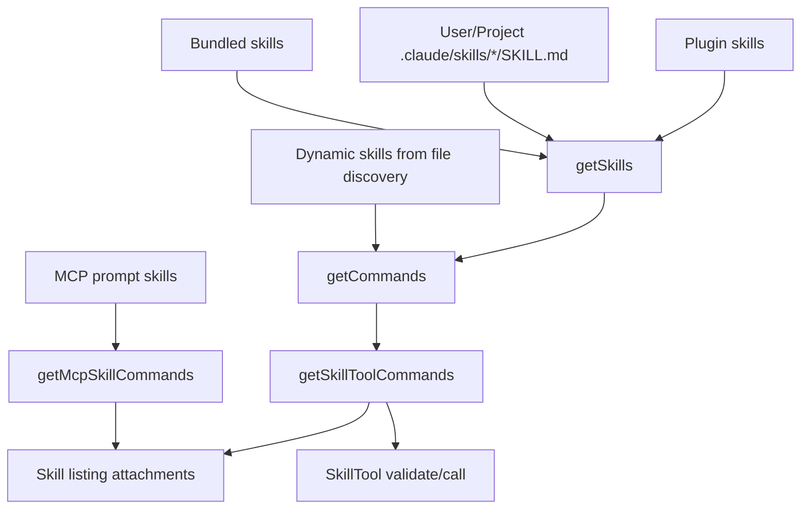
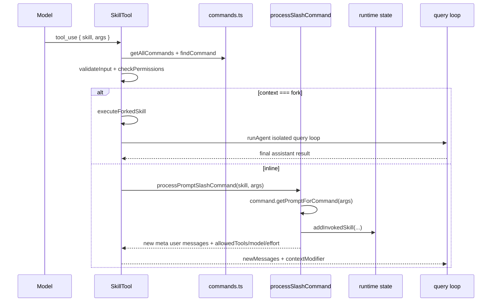
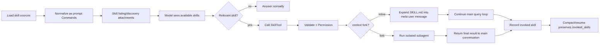

# Claude Code Skill 流程分析

本文基于当前仓库中的 Claude Code TypeScript 实现，梳理 skill 从加载、注入上下文、模型调用、权限校验、执行到 compact/resume 的完整链路，并给出 Morty 后续实现参考。

## 一句话结论

Claude Code 的 skill 不是一套孤立机制，而是建立在 `Command` 体系之上的“模型可调用 prompt command”。本地 `SKILL.md`、插件 skill、MCP skill、动态发现 skill 最终都会被归一成 `type: 'prompt'` 的 `Command`，再通过 `SkillTool` 暴露给模型。

核心设计是：

- 启动或每轮只给模型注入 skill 名称、描述、`when_to_use` 等轻量索引。
- 模型判断相关后必须调用 `SkillTool`。
- `SkillTool` 再按需加载完整 `SKILL.md` 内容，并把它转成新的 meta user message 继续驱动主会话或 forked subagent。
- 已调用 skill 会记录到 `invoked_skills`，用于 compact/resume 后继续保留能力上下文。

## 主要代码入口

| 职责 | 代码位置 |
| --- | --- |
| SkillTool 定义、校验、权限、执行 | `src/tools/SkillTool/SkillTool.ts` |
| SkillTool 系统提示词和 listing budget | `src/tools/SkillTool/prompt.ts` |
| command/skill 统一加载入口 | `src/commands.ts` |
| 本地 `.claude/skills/*/SKILL.md` 加载 | `src/skills/loadSkillsDir.ts` |
| 插件 skill 加载 | `src/utils/plugins/loadPluginCommands.ts` |
| skill listing/discovery attachment 注入 | `src/utils/attachments.ts` |
| slash command / skill 展开为消息 | `src/utils/processUserInput/processSlashCommand.tsx` |
| forked skill subagent 上下文准备 | `src/utils/forkedAgent.ts` |
| invoked skill 运行态状态 | `src/bootstrap/state.ts` |
| resume 时恢复 skill 状态 | `src/utils/conversationRecovery.ts` |
| system prompt 里的 DiscoverSkills 指导 | `src/constants/prompts.ts` |

## Skill 的来源与归一化

Claude Code 的 skill 来源很多，但最终都进入 `Command` 列表。



`src/commands.ts` 中的 `getCommands(cwd)` 是总入口。它会并行加载：

- `getSkillDirCommands(cwd)`：本地 skill 目录。
- `getPluginSkills()`：插件 skill。
- `getBundledSkills()`：内置 skill。
- `getBuiltinPluginSkillCommands()`：内置插件 skill。
- `getPluginCommands()` / workflow / built-in commands。

之后 `getSkillToolCommands(cwd)` 再筛出模型可调用的 prompt command：

- `cmd.type === 'prompt'`
- `!cmd.disableModelInvocation`
- `cmd.source !== 'builtin'`
- 必须来自 skills/bundled/legacy commands，或者显式有描述/`whenToUse`

MCP skill 独立来自 `AppState.mcp.commands`，通过 `getMcpSkillCommands()` 筛选 `loadedFrom === 'mcp'` 的 prompt command。

## `SKILL.md` 如何变成 Command

本地 skill 目录只支持目录格式：

```text
.claude/skills/
  my-skill/
    SKILL.md
```

`src/skills/loadSkillsDir.ts` 会读取 `SKILL.md`，解析 frontmatter，然后调用 `createSkillCommand()` 生成 `Command`。

关键 frontmatter 字段会映射成 command 属性：

| frontmatter | Command 字段 | 作用 |
| --- | --- | --- |
| `description` | `description` | skill listing 中的短描述 |
| `when_to_use` | `whenToUse` | 模型何时使用该 skill |
| `allowed-tools` | `allowedTools` | skill 执行后临时放开的工具 |
| `argument-hint` / `arguments` | `argumentHint` / `argNames` | 参数提示和命名参数替换 |
| `model` | `model` | skill 指定模型 |
| `effort` | `effort` | skill 指定推理强度 |
| `disable-model-invocation` | `disableModelInvocation` | 禁止模型主动调用 |
| `user-invocable` | `userInvocable` | 是否作为用户可见命令 |
| `context: fork` | `context` | 使用 forked subagent 执行 |
| `agent` | `agent` | fork 时指定 agent 类型 |
| `hooks` | `hooks` | skill 加载后注册 hooks |
| `paths` | `paths` | 条件/路径相关 skill 匹配 |

`getPromptForCommand(args, context)` 是真正按需加载 skill 内容的地方。它会：

1. 在内容前附加 `Base directory for this skill: ...`。
2. 替换 `$ARGUMENTS` 和命名参数。
3. 替换 `${CLAUDE_SKILL_DIR}` 与 `${CLAUDE_SESSION_ID}`。
4. 对非 MCP skill 执行 markdown 中的 shell 注入。
5. 返回 text block，后续作为 meta user message 注入模型。

MCP skill 被视为远端不可信内容，所以不会执行 markdown 中的 shell 注入。

## Skill 如何进入模型上下文

Claude 没有把所有 `SKILL.md` 全文塞进系统提示词，而是分层注入。

### 1. SkillTool 自身提示词

`src/tools/SkillTool/prompt.ts` 的 `getPrompt()` 会告诉模型：

- 用户要求任务时，要检查可用 skills。
- 如果有匹配 skill，调用 `SkillTool` 是阻塞要求。
- 不要只提到 skill 而不调用。
- 不要调用已经在运行的 skill。
- 如果当前 turn 已经出现 `<COMMAND_NAME_TAG>`，说明 skill 已加载，直接执行其中指令。

### 2. `skill_listing` attachment

`src/utils/attachments.ts` 的 `getSkillListingAttachments()` 会把当前可用 skill 列表作为 `skill_listing` attachment 注入会话。

这个列表有严格预算控制：

- 默认预算是上下文窗口字符数的 1%。
- 每条 description 最多 250 字符。
- 优先保留 bundled skill 描述。
- 预算不足时，非 bundled skill 会被截断，极端情况只保留名称。

这就是 Claude 能支持大量 skill 但不炸上下文的关键。

### 3. `skill_discovery` attachment

在启用 `EXPERIMENTAL_SKILL_SEARCH` 时，Claude 会根据用户输入和历史消息做 skill discovery，然后把相关 skill 作为 `skill_discovery` attachment 注入。

`processSlashCommand` 展开 `SKILL.md` 时会显式传 `skipSkillDiscovery: true`，避免大段 skill 文档内容再次触发 skill discovery。代码注释里提到，一个 110KB 的 `SKILL.md` 如果不跳过，会导致每次 skill 调用额外触发多秒级检索。

### 4. 动态 skill

文件读取/目录探索过程中可能发现新的 `SKILL.md`，这些目录会进入 `dynamicSkillDirTriggers`。后续 attachment 逻辑会把动态 skill 注入上下文，并通过 `clearCommandMemoizationCaches()` 让 command 列表刷新。

## 模型调用 SkillTool 的完整路径



### 校验阶段

`SkillTool.validateInput()` 会做这些事：

- trim skill 名称，兼容去掉前导 `/`。
- 支持实验性的 remote canonical skill。
- 从 command 列表里查找 skill。
- 拒绝不存在的 skill。
- 拒绝 `disableModelInvocation`。
- 拒绝非 `prompt` 类型 command。

### 权限阶段

`SkillTool.checkPermissions()` 的优先级大致是：

1. skill-specific deny rule 优先。
2. remote canonical skill 在 deny 之后可自动允许。
3. allow rule 命中则允许。
4. 如果 command 只包含安全属性，则自动允许。
5. 否则弹出权限确认，并建议写入精确规则或 `skill:*` 前缀规则。

Claude 对“安全属性”做了白名单，避免未来新增 frontmatter 属性后被意外自动放行。

## Inline Skill 执行

普通 skill 走 inline 路径：

1. `SkillTool.call()` 调用 `processPromptSlashCommand()`。
2. `processPromptSlashCommand()` 找到 command 后调用 `getMessagesForPromptSlashCommand()`。
3. `getPromptForCommand()` 加载完整 skill 内容并完成参数替换。
4. 如果 skill 定义了 hooks 且来源可信，则注册 hooks。
5. 调用 `addInvokedSkill()` 记录 skill 内容。
6. 构造消息：
   - 一条命令加载 metadata。
   - 一条 meta user message，内容是完整 skill prompt。
   - 可能附带 `@file`、MCP resource、agent mention 等 attachment。
   - 一条 `command_permissions` attachment，携带 `allowedTools` 和 `model`。
7. `SkillTool` 把这些消息通过 `newMessages` 返回 query loop。
8. `contextModifier` 临时修改 allowed tools、model、effort。

所以 inline skill 本质上不是“立即执行代码”，而是“把 skill 指令注入当前对话，让主模型继续执行”。

## Forked Skill 执行

如果 `SKILL.md` frontmatter 里声明 `context: fork`，则走 forked subagent。

`prepareForkedCommandContext()` 会：

- 调 `command.getPromptForCommand(args, context)` 取得 skill 内容。
- 解析 `allowedTools` 并构造新的 `getAppState`。
- 根据 `agent` 字段选择 agent 类型，默认 `general-purpose`。
- 生成一条 user message 作为 subagent 初始输入。

`executeForkedSkill()` 再用 `runAgent()` 启动隔离 query loop。forked agent 默认隔离可变状态，但会复用 cache-safe 参数来尽量命中父会话 prompt cache。完成后，`SkillTool` 把 subagent 最后一条 assistant 消息提取为 skill 结果返回主会话。

## Compact / Resume 如何保留 Skill

Claude 会在 runtime state 里记录已调用 skill：

```text
STATE.invokedSkills: Map<agentId + skillName, InvokedSkillInfo>
```

`addInvokedSkill()` 记录：

- skill 名称。
- skill path。
- skill 完整内容。
- 调用时间。
- agentId。

这样 compact 时可以把已加载 skill 以 `invoked_skills` attachment 形式保留下来。resume 时，`restoreSkillStateFromMessages()` 会扫描历史消息中的 `invoked_skills` attachment，把它们重新写回 `STATE.invokedSkills`。

同时，resume 时如果历史里已经有 `skill_listing`，会调用 `suppressNextSkillListing()`，避免新进程启动后重复向模型注入相同 skill 列表，浪费上下文。

## 为什么这套设计能长上下文运行

Claude 的 skill 设计避免了几个常见坑：

- 不在系统提示词中塞所有 skill 全文。
- skill 列表有预算、截断和去重。
- 完整 skill 内容只在调用时加载。
- skill 加载后被记录，compact/resume 可恢复。
- `skipSkillDiscovery` 避免 skill 内容反向触发 skill 搜索。
- forked skill 使用隔离上下文，避免污染主 agent 状态。
- resume 后抑制重复 listing，降低上下文膨胀。

## 对 Morty 的实现启示

Morty 如果要贴近 Claude 的 skill 体验，不应该只做“读一个 SKILL.md 然后拼进 prompt”。更稳的方向是：

1. 统一 registry

   把 slash command、skill、plugin skill、MCP prompt 统一成一种 `Command` 或 `Capability` 对象，字段至少包含：

   - `name`
   - `description`
   - `when_to_use`
   - `source`
   - `loaded_from`
   - `allowed_tools`
   - `model`
   - `effort`
   - `context`
   - `agent`
   - `get_prompt(args, context)`

2. 分离 listing 与全文加载

   启动/每轮只注入轻量 skill listing。模型调用 skill 后，再加载完整 markdown。

3. SkillTool 做成标准 runtime tool

   `SkillTool` 应该负责：

   - 校验 skill 名称。
   - 做权限判断。
   - 加载 skill 内容。
   - 生成新的 meta user message。
   - 临时修改 allowed tools/model/effort。
   - 支持 inline 和 fork 两种执行模式。

4. discovery 异步化

   skill discovery 应该尽量并发预取，不要阻塞主 turn。初轮可以短超时同步注入，后续结果可以作为下一轮 attachment 回灌。

5. compact/resume 明确保留 invoked skills

   compact 消息里需要保留已调用 skill 的完整内容和来源。resume 后恢复 runtime state，并抑制重复 listing。

6. 安全策略独立

   skill 权限不能只看“这是 skill”。需要区分：

   - 本地用户 skill。
   - 项目 skill。
   - 插件 skill。
   - MCP skill。
   - remote skill。

   MCP/remote skill 默认应视为不可信，尤其不能执行 markdown shell 注入。

## Claude Skill 流程总图



## 关键差异点

Claude 的 skill 机制好用，靠的不是某一个 prompt，而是一组边界清晰的工程机制：

- `Command` 统一抽象解决“多来源能力混乱”。
- `SkillTool` 解决“模型何时加载全文”和“权限怎么判断”。
- attachment 解决“每轮给模型看什么”。
- `invoked_skills` 解决“compact 后不丢已加载能力”。
- forked agent 解决“复杂能力隔离执行”。

这也是 Morty 后续实现时应该对齐的主线。
